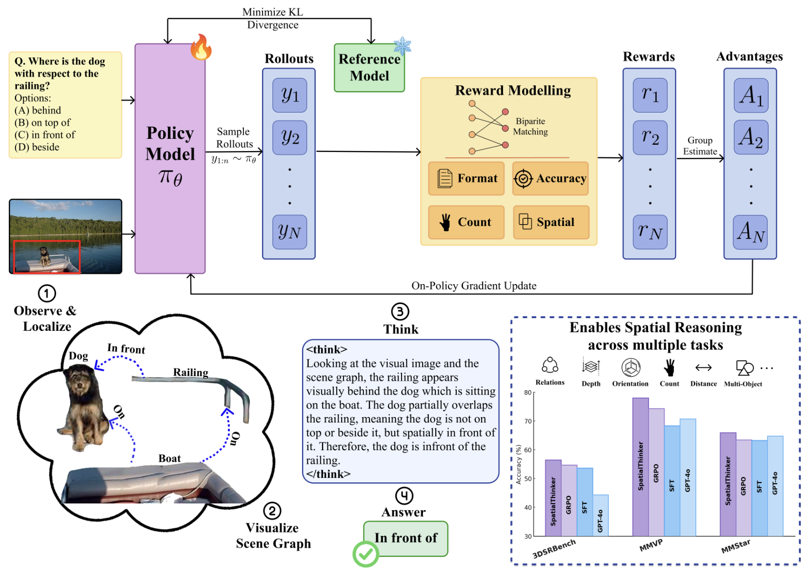
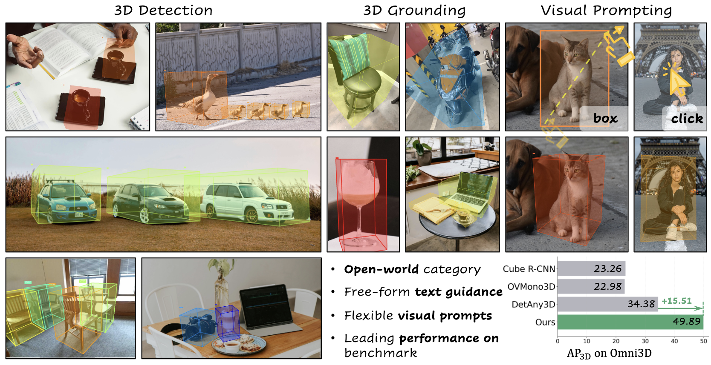
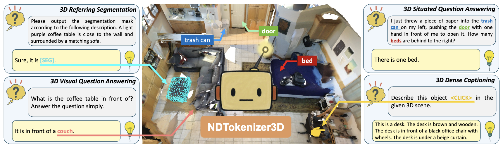
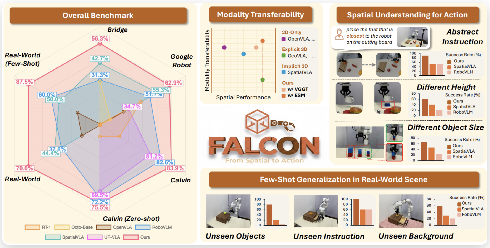
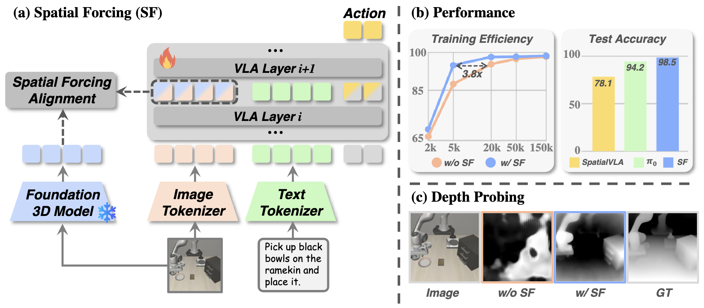
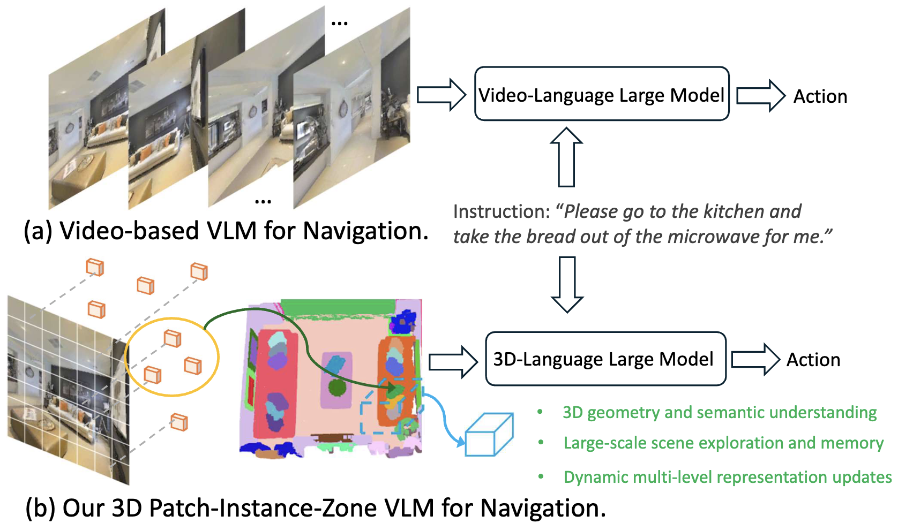
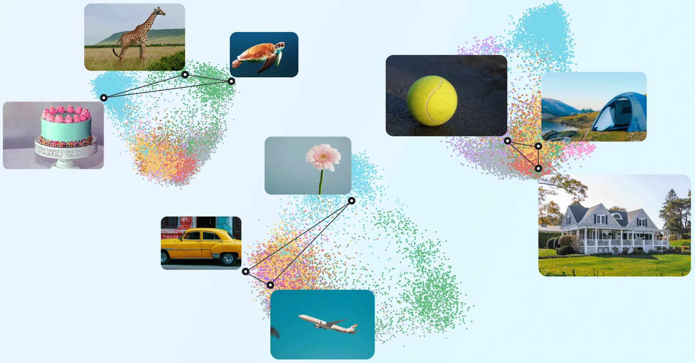
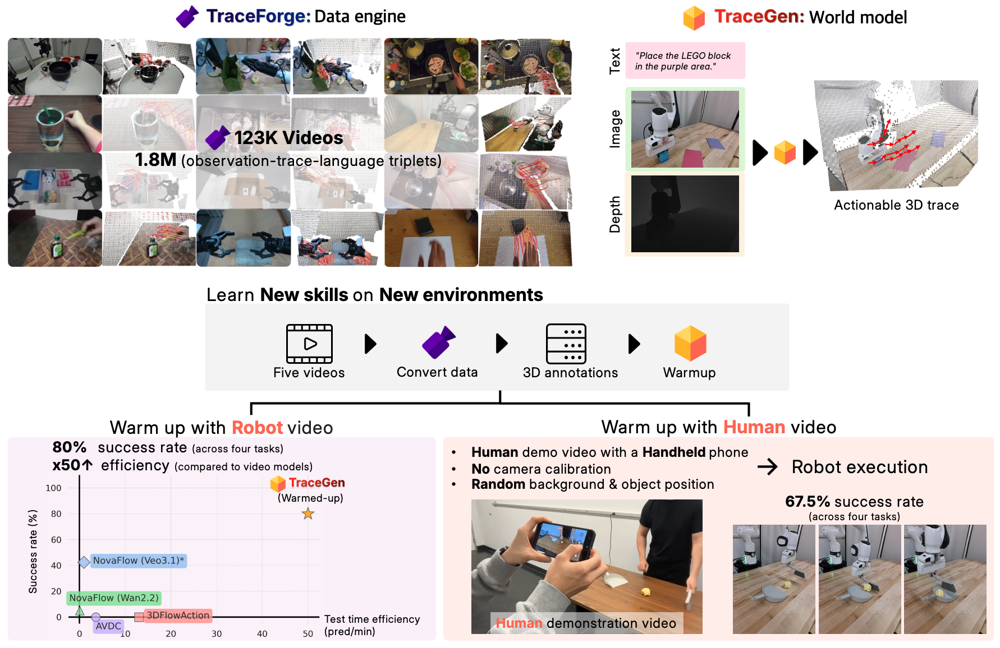
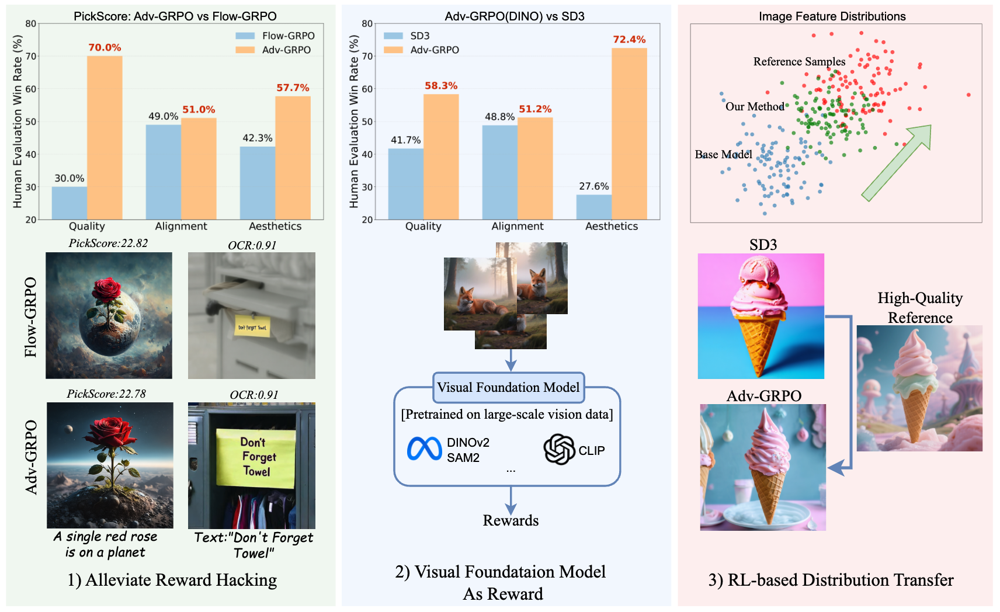

Reading (December 2025)
=======================

:bdg-blue:`Dec 06, 25` **SpatialThinker: Reinforcing 3D Reasoning in Multimodal LLMs via Spatial Rewards.** Hunar Batra, Haoqin Tu, Hardy Chen, Yuanze Lin, Cihang Xie, Ronald Clark.
`[arXiv] <https://arxiv.org/abs/2511.07403>`_
|area-3d|

:bdg-blue:`Dec 06, 25` **LocateAnything3D: Vision-Language 3D Detection with Chain-of-Sight.** Yunze Man, Shihao Wang, Guowen Zhang, Johan Bjorck, Zhiqi Li, Liang-Yan Gui, Jim Fan, Jan Kautz, Yu-Xiong Wang, Zhiding Yu.
`[webpage] <https://nvlabs.github.io/LocateAnything3D>`_ `[arXiv] <https://arxiv.org/abs/2511.20648>`_
|area-3d|

:bdg-blue:`Dec 03, 25` **Scenes as Tokens: Multi-Scale Normal Distributions Transform Tokenizer for General 3D Vision-Language Understanding.** Yutao Tang, Cheng Zhao, Gaurav Mittal, Rohith Kukkala, Rama Chellappa, Cheng Peng, Mei Chen.
`[arXiv] <https://arxiv.org/abs/2511.21191>`_
|area-3d|

:bdg-blue:`Dec 03, 25` **From Spatial to Actions: Grounding Vision-Language-Action Model in Spatial Foundation Priors.** Zhengshen Zhang, Hao Li, Yalun Dai, Zhengbang Zhu, Lei Zhou, Chenchen Liu, Dong Wang, Francis E. H. Tay, Sijin Chen, Ziwei Liu, Yuxiao Liu, Xinghang Li, Pan Zhou.
`[webpage] <https://falcon-vla.github.io/>`_ `[arXiv] <https://arxiv.org/abs/2510.17439>`_
|area-3d| |area-robot|

:bdg-blue:`Dec 03, 25` **Spatial Forcing: Implicit Spatial Representation Alignment for Vision-language-action Model.** Fuhao Li, Wenxuan Song, Han Zhao, Jingbo Wang, Pengxiang Ding, Donglin Wang, Long Zeng, Haoang Li.
`[webpage] <https://spatial-forcing.github.io/>`_ `[arXiv] <https://arxiv.org/abs/2510.12276>`_
|area-3d| |area-robot|

:bdg-blue:`Dec 03, 25` **Dynam3D: Dynamic Layered 3D Tokens Empower VLM for Vision-and-Language Navigation.** Zihan Wang, Seungjun Lee, Gim Hee Lee.
`[arXiv] <https://arxiv.org/pdf/2505.11383>`_
|area-3d|

:bdg-blue:`Dec 01, 25` **Teaching AI to see the world more like we do.** Andrew Lampinen, Klaus Greff.
`[deepmind.google] <https://deepmind.google/blog/teaching-ai-to-see-the-world-more-like-we-do/>`_
|area-vision|

:bdg-blue:`Dec 01, 25` **TraceGen: World Modeling in 3D Trace-Space Enables Learning from Cross-Embodiment Videos.** Seungjae Lee, Yoonkyo Jung, Inkook Chun, Yao-Chih Lee, Zikui Cai, Hongjia Huang, Aayush Talreja, Tan Dat Dao, Yongyuan Liang, Jia-Bin Huang, Furong Huang.
`[arXiv] <https://arxiv.org/abs/2511.21690>`_
|area-robot|

:bdg-blue:`Dec 01, 25` **The Image as Its Own Reward: Reinforcement Learning with Adversarial Reward for Image Generation.** Weijia Mao, Hao Chen, Zhenheng Yang, Mike Zheng Shou.
`[arXiv] <https://arxiv.org/abs/2511.20256>`_
|area-llm|

