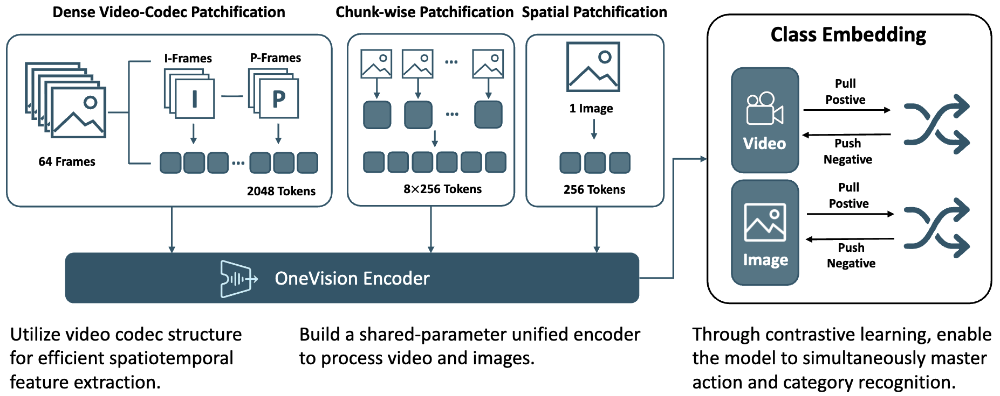
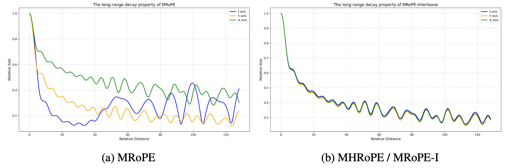
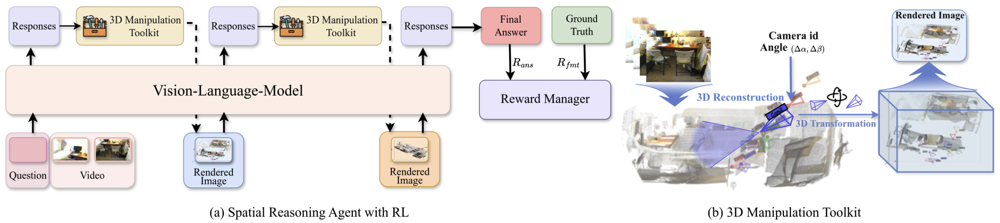
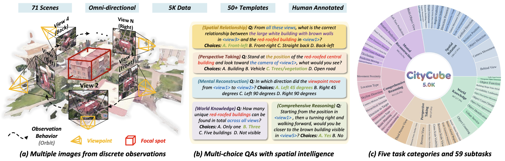
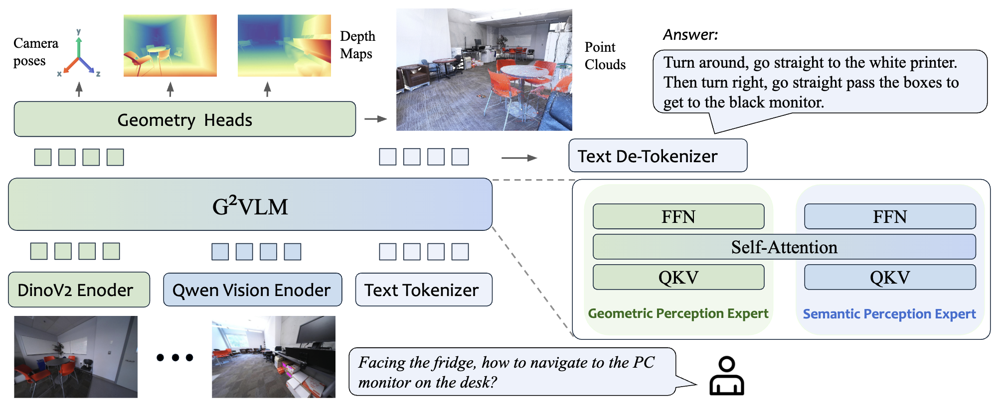
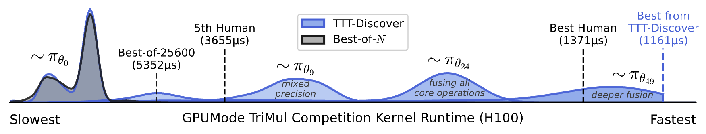

Reading (February 2026)
=======================

:bdg-blue:`Feb 18 ,26` **OneVision-Encoder: Codec-Aligned Sparsity as a Foundational Principle for Multimodal Intelligence.** Feilong Tang, Xiang An, Yunyao Yan, Yin Xie, Bin Qin, Kaicheng Yang, Yifei Shen, Yuanhan Zhang, Chunyuan Li, Shikun Feng, Changrui Chen, Huajie Tan, Ming Hu, Manyuan Zhang, Bo Li, Ziyong Feng, Ziwei Liu, Zongyuan Ge, Jiankang Deng.
`[arXiv] <https://arxiv.org/abs/2602.08683>`_
|area-vision|

Studying **compression** in vision encoder design. Codec Patchification based on HEVC metadata.

:bdg-blue:`Feb 18, 26` **DreamZero: World Action Models are Zero-shot Policies.** Seonghyeon Ye et al.
`[webpage] <https://dreamzero0.github.io/>`_
|area-robot|

:bdg-blue:`Feb 17, 26` **Revisiting Multimodal Positional Encoding in Vision-Language Models.** Jie Huang, Xuejing Liu, Sibo Song, Ruibing Hou, Hong Chang, Junyang Lin, Shuai Bai.
`[arXiv] <https://arxiv.org/abs/2510.23095>`_
|area-llm|

One limitation with multi-modal RoPE (MRoPE) is the imbalanced allocation of freqeuncy on the time, height, and width dimensions. This leads to different long-term decay properties. The authors proposed multi-head RoPE (MHRoPE) and RoPE-interleave (MRoPE-I).

:bdg-blue:`Feb 16, 26` **Better & Faster Large Language Models via Multi-token Prediction.** Fabian Gloeckle, Badr Youbi Idrissi, Baptiste Rozière, David Lopez-Paz, Gabriel Synnaeve.
`[arXiv] <https://arxiv.org/abs/2404.19737>`_
|area-llm|

:bdg-blue:`Feb 03, 26` **SIMS-V: Simulated Instruction-Tuning for Spatial Video Understanding.** Ellis Brown, Arijit Ray, Ranjay Krishna, Ross Girshick, Rob Fergus, Saining Xie.
`[arXiv] <https://arxiv.org/abs/2511.04668>`_
|area-3d| |area-vlm|

:bdg-blue:`Feb 03, 26` **Cambrian-S: Towards Spatial Supersensing in Video.** Shusheng Yang, Jihan Yang, Pinzhi Huang, Ellis Brown, Zihao Yang, Yue Yu, Shengbang Tong, Zihan Zheng, Yifan Xu, Muhan Wang, Daohan Lu, Rob Fergus, Yann LeCun, Li Fei-Fei, Saining Xie.
`[arXiv] <https://arxiv.org/abs/2511.04670>`_
|area-3d| |area-vlm|

:bdg-blue:`Feb 03, 26` **Think3D: Thinking with Space for Spatial Reasoning.** Zaibin Zhang, Yuhan Wu, Lianjie Jia, Yifan Wang, Zhongbo Zhang, Yijiang Li, Binghao Ran, Fuxi Zhang, Zhuohan Sun, Zhenfei Yin, Lijun Wang, Huchuan Lu.
`[arXiv] <https://arxiv.org/abs/2601.13029>`_
|area-3d| |area-vlm|

:bdg-blue:`Feb 03, 26` **CityCube: Benchmarking Cross-view Spatial Reasoning on Vision-Language Models in Urban Environments.** Haotian Xu, Yue Hu, Zhengqiu Zhu, Chen Gao, Ziyou Wang, Junreng Rao, Wenhao Lu, Weishi Li, Quanjun Yin, Yong Li.
`[arXiv] <https://arxiv.org/abs/2601.14339>`_
|area-3d| |area-vlm|

:bdg-blue:`Feb 02, 26` **Emerging Properties in Unified Multimodal Pretraining.** Chaorui Deng, Deyao Zhu, Kunchang Li, Chenhui Gou, Feng Li, Zeyu Wang, Shu Zhong, Weihao Yu, Xiaonan Nie, Ziang Song, Guang Shi, Haoqi Fan.
`[arXiv] <https://arxiv.org/abs/2505.14683>`_
|area-vlm|

:bdg-blue:`Feb 02, 26` **G2VLM: Geometry Grounded Vision Language Model with Unified 3D Reconstruction and Spatial Reasoning.** Wenbo Hu, Jingli Lin, Yilin Long, Yunlong Ran, Lihan Jiang, Yifan Wang, Chenming Zhu, Runsen Xu, Tai Wang, Jiangmiao Pang.
`[arXiv] <https://arxiv.org/abs/2511.21688>`_
|area-3d| |area-vlm|

**Model architecture.** A mixture-of-transformer-experts (MoT) architecture with a geometry perception expert and a semantic perception expert.

**Visual geometry learning.** The geometric perception expert is initialized from scratch and trained following MoGe and :math:`\pi^3`. The loss is a weighted sum of point reconstruction loss, camera pose loss, and normal loss.

:bdg-blue:`Feb 02, 26` **One-step Latent-free Image Generation with Pixel Mean Flows.** Yiyang Lu, Susie Lu, Qiao Sun, Hanhong Zhao, Zhicheng Jiang, Xianbang Wang, Tianhong Li, Zhengyang Geng, Kaiming He.
`[arXiv] <https://arxiv.org/abs/2601.22158>`_
|area-gen|

:bdg-blue:`Feb 02, 26` **One-Minute Video Generation with Test-Time Training.** Karan Dalal, Daniel Koceja, Gashon Hussein, Jiarui Xu, Yue Zhao, Youjin Song, Shihao Han, Ka Chun Cheung, Jan Kautz, Carlos Guestrin, Tatsunori Hashimoto, Sanmi Koyejo, Yejin Choi, Yu Sun, Xiaolong Wang.
`[arXiv] <https://arxiv.org/abs/2504.05298v1>`_
|area-gen|

:bdg-blue:`Feb 02, 26` **Learning to Discover at Test Time.** Mert Yuksekgonul, Daniel Koceja, Xinhao Li, Federico Bianchi, Jed McCaleb, Xiaolong Wang, Jan Kautz, Yejin Choi, James Zou, Carlos Guestrin, Yu Sun.
`[arXiv] <https://arxiv.org/abs/2601.16175>`_
|area-llm|

